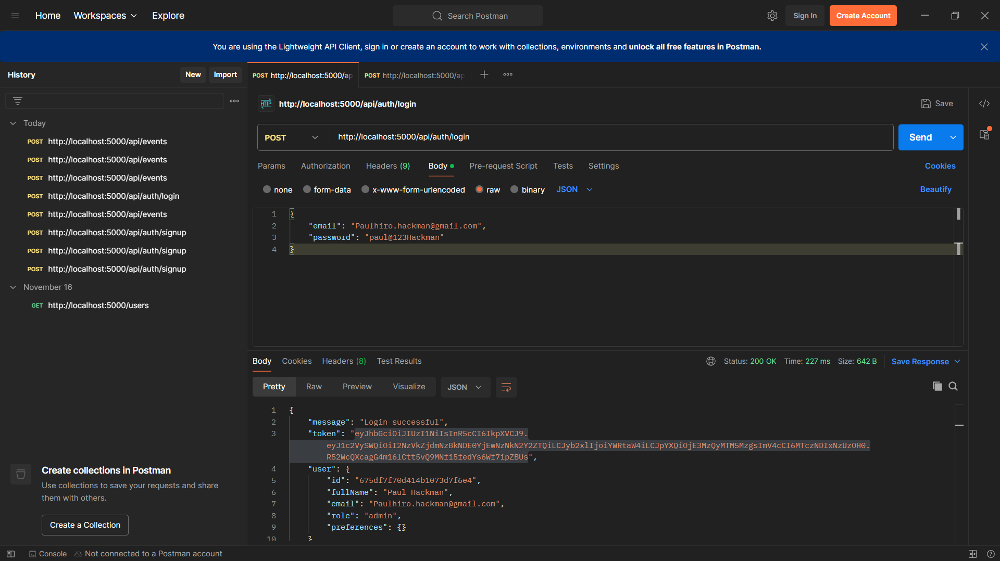
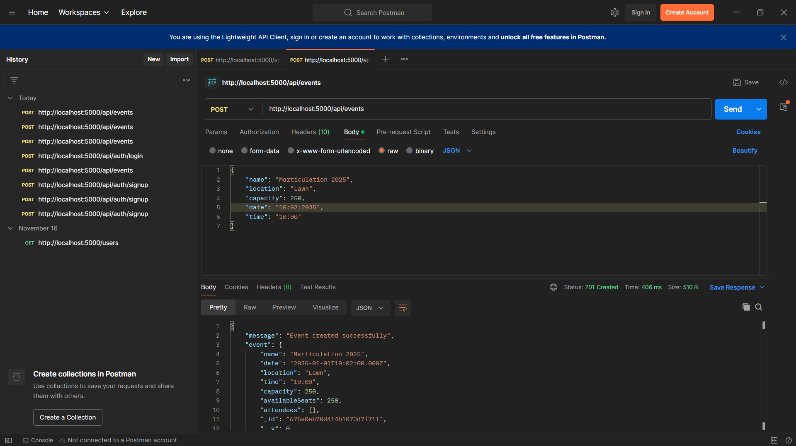

Here’s a comprehensive README file template for your **Campus Event Management System** project based on the provided requirements:

---

# **Campus Event Management System**

## Project Overview

The **Campus Event Management System** is an online platform designed to help students and staff of a campus community discover, register for, and create events. The system enables users to register and log in, set preferences for the type of events they are interested in, view upcoming events with event details (like date, time, location, available seats), and RSVP for events. Additionally, admins can create new events and manage event details such as capacity and location. A calendar view is integrated to allow users to filter and view events by date.

## Deployment Link

- **Frontend Application**: [https://event-management-hub.vercel.app/](#)  

## Login Details

If the project includes authentication, use the following test credentials to log in:

## Admin login Detail
- **Username**: Paulhiro.hackman@gmail.com  
- **Password**: paul@123Hackman

## User login Detail
- **Username**: user1@gmail.com
- **Password**: user@123Hackman

## Feature Checklist

- [x] **User Registration & Login**: Users can register, log in, and set event preferences.
- [x] **Event Listings & RSVP**: Users can view upcoming events, RSVP for events, and update available seats.
- [x] **Event Creation (Admin Only)**: Admins can create events with a unique ID, details, and capacity.
- [x] **Event Calendar View**: A calendar view to display events by date and filter based on event preferences.
  
## Installation Instructions

To run this project locally, follow these steps:

1. **Clone the repository**:

   ```bash
   git clone https://github.com/begcodee/full-event-management-hub.git
   ```

2. **Navigate to the project directory**:

   ```bash
   cd full-event-management-hub
   ```

3. **Install dependencies**:

   If you are using npm:

   ```bash
   npm install
   ```

   Or if you are using yarn:

   ```bash
   yarn install
   ```

4. **Start the application**:

   ```bash
   npm start
   ```

   Or:

   ```bash
   yarn start
   ```

5. Open your browser and go to `http://localhost:3000` to see the project running locally.

## API Documentation

The backend API allows communication between the frontend and the database. Below is an example of how to test the endpoints using Postman.

### Example API Endpoints:

1. **POST /api/auth/register**
   - Register a new user.
   - Request Body: `{ "username": "newuser", "email": "newuser@example.com", "password": "password123" }`

2. **POST /api/auth/login**
   - Log in a user.
   - Request Body: `{ "email": "testuser@example.com", "password": "password123" }`

3. **GET /api/events**
   - Retrieve the list of upcoming events.
   - Response: `[ { "eventId": 1, "eventName": "Workshop on AI", "date": "2024-12-20", "time": "10:00 AM", "location": "Room 101", "availableSeats": 50 }, { ... } ]`

4. **POST /api/events/rsvp**
   - RSVP for an event.
   - Request Body: `{ "eventId": 1, "userId": 123 }`
   - Response: `{ "message": "RSVP successful", "availableSeats": 49 }`

5. **POST /api/events/create**
   - Create a new event (Admin only).
   - Request Body: `{ "eventName": "Seminar on Blockchain", "date": "2024-12-15", "location": "Room 202", "capacity": 100 }`

### Screenshot of Postman API Test

  



## Deployment Requirements

To deploy this project, ensure the following requirements are met:

1. **Frontend**: 
   - The frontend is built using React (or your chosen frontend framework).
   - Deployed using services like **Vercel**.

2. **Backend**:
   - A backend server (preferably using **Express.js**, **Node.js**, or any backend framework of your choice).
   - Ensure the server is deployed to a platform like  **Vercel**.

3. **Database**:
   - A database such as **MongoDB** is used to store user data, event details, and RSVP information.
   - The database should be connected and accessible to the backend.

4. **Authentication**:
   - Implement secure user authentication with JWT (JSON Web Tokens) or sessions.
   - Use libraries like **JWT** for authentication.

---

This README will help users understand how to interact with your project, install it locally, and view the deployed version.